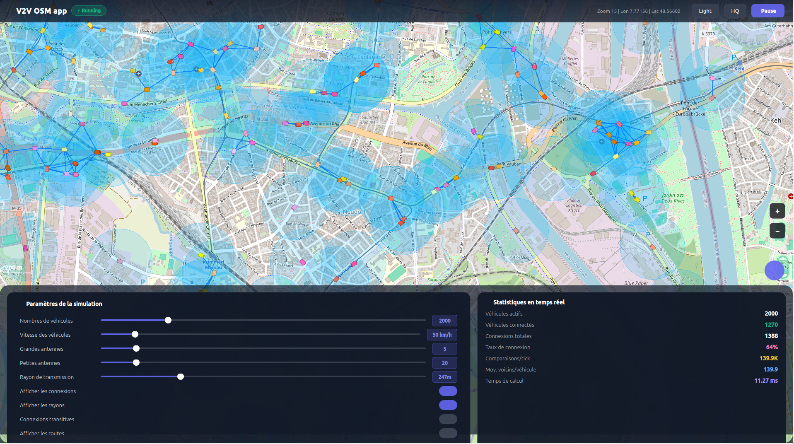
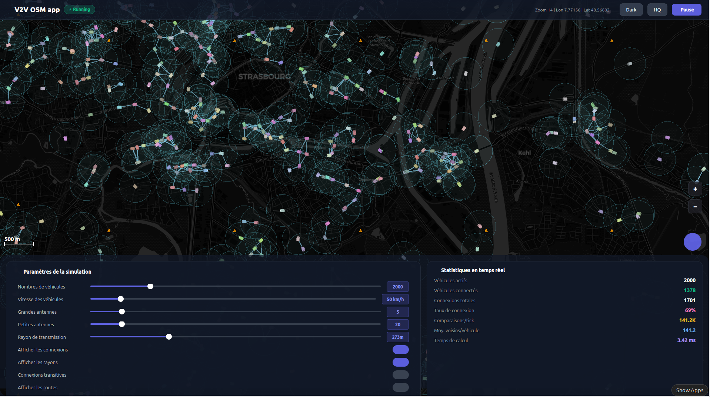

# V2V Communication Simulator

<div align="center">

**Real-time Vehicle-to-Vehicle communication simulator with OpenStreetMap visualization**

[Demo](#demo) • [Features](#features) • [Quick Start](#quick-start) • [Tech Stack](#tech-stack) • [Documentation](#documentation)

</div>

---

## Demo
*Light mode simulation execution*

*Dark mode simulation execution*


> Simulate up to 3000 vehicles communicating in real-time on actual road networks from OpenStreetMap

---

## Features

- 🗺️ **Real map data** - Load OpenStreetMap (OSM PBF) files and build routing networks automatically
- 🚗 **Large-scale simulation** - Support for 1 to 3000 vehicles running simultaneously at 20 FPS
- 📡 **V2V Communication** - Interference graph modeling wireless communication range between vehicles
- 🔗 **Multi-hop routing** - Optional transitive closure for multi-hop message propagation
- ⚡ **Optimized performance** - Spatial grid with K-means clustering reduces O(n²) to O(n) complexity
- 🎨 **Interactive UI** - Real-time controls, live statistics, and dark/light themes
- 📊 **Live analytics** - Monitor connections, communication stats, and rendering performance

---

## Quick Start

### Prerequisites

- **CMake** 3.16+
- **C++17** compiler
- **Qt5** or **Qt6** (5.15+ / 6.x)
- **Boost** 1.71+
- **libosmium** 2.15+
- **PROJ** 6.0+

### Installation (Ubuntu/Debian)

```bash
sudo apt update
sudo apt install -y \
    build-essential cmake \
    qtbase5-dev qttools5-dev libqt5svg5-dev \
    libboost-all-dev \
    libosmium2-dev \
    libproj-dev \
    zlib1g-dev libbz2-dev libexpat1-dev
```

### Build & Run

```bash
git clone https://github.com/yourusername/projet_v2v.git
cd projet_v2v

mkdir -p build && cd build
cmake ..
make -j$(nproc)

./ConnectedVehicles
```

The app loads `data/strasbourg.osm.pbf` by default. Replace with your own OSM PBF file to simulate different cities.

---

## Tech Stack

| Component | Technology |
|-----------|-----------|
| **GUI** | Qt5/Qt6 |
| **Graphs** | Boost Graph Library |
| **Map data** | libosmium (OpenStreetMap) |
| **Geospatial** | PROJ |
| **Compiler** | C++17 |
| **Build** | CMake |

---

## Keyboard Controls

| Key | Action |
|-----|--------|
| Arrow keys | Pan map |
| `+` / `-` | Zoom in/out |
| `Space` | Play/Pause |
| `T` | Toggle multi-hop |
| `B` | Toggle dark/light theme |
| `L` | Toggle quality mode |

---

## Project Structure

```
projet_v2v/
├── include/          # Headers
│   ├── simulator.h           # Main simulation engine
│   ├── vehicule.h            # Vehicle movement & logic
│   ├── interference_graph.h  # V2V communication model
│   ├── spatial_grid.h        # K-means optimization
│   ├── map_view.h            # Map rendering
│   └── ...
├── src/              # Implementation
├── data/             # Map data (OSM PBF)
└── CMakeLists.txt
```

---

## Documentation

- **[DOCUMENTATION.md](DOCUMENTATION.md)** - Full technical documentation (algorithms, architecture, detailed API)

For deep dives into:
- Module architecture
- Algorithm complexity analysis  
- UI component details
- Spatial indexing implementation

See [DOCUMENTATION.md](DOCUMENTATION.md).

---

## License

[Add your license here - MIT, GPL, etc.]

---

## Author

[Your name/GitHub profile]

